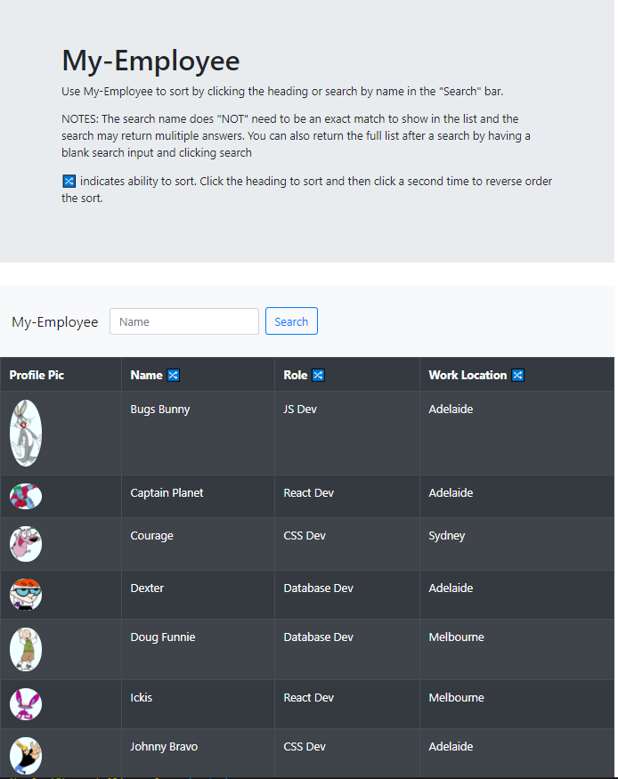
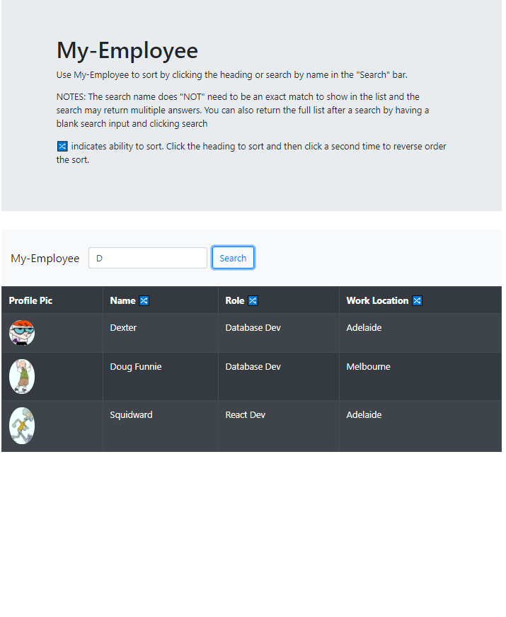
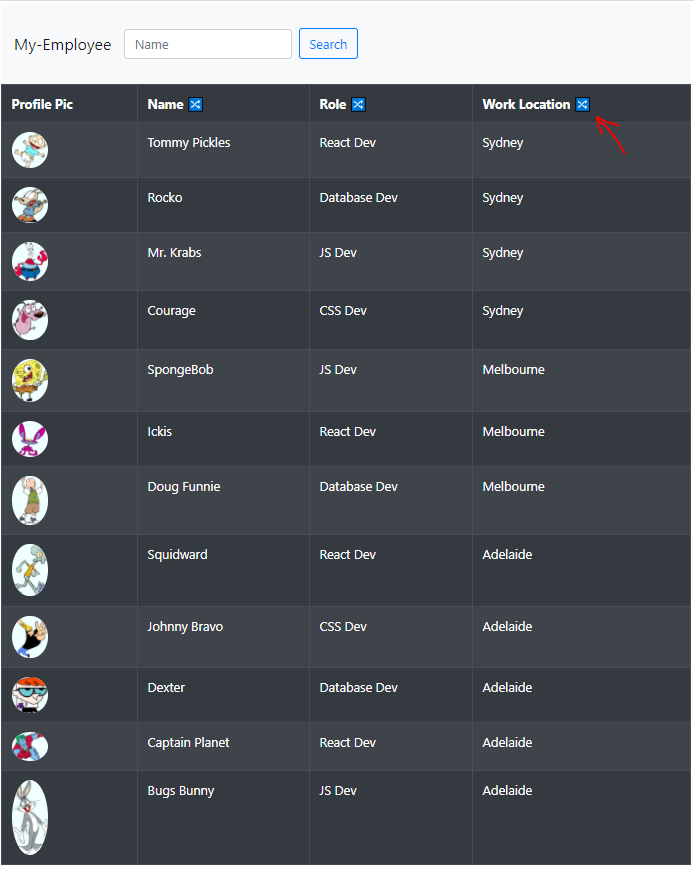

# My-Employee 
  

  ## Description ✏️
  
  View employee directory and access their information with ability to sort and search.
  
  ## Table of Contents 📚
  
  * [Installation](#installation)
  * [Usage](#usage)
  * [License](#license)
  * [Contributing](#Contributing)
  * [Testing](#Testing)
  * [Questions](#Questions)
  
  ## Installation 

  ```
  📥 No installation required.  
  Access @ https://emoschos.github.io/my-employee/
  Repo @ https://github.com/EMoschos/my-employee
  ```

  ## Usage 

  ```
  ▶️ Open the app through the provided link.  Use My-Employee to sort by clicking the heading or search by name in the "Search" bar.  The search name does "NOT" need to be an exact match to show in the list and the search may return multiple answers. You can also return the full list after a search by having a blank search input and clicking search. 🔀 indicates ability to sort. Click the heading to sort and then click a second time to reverse order the sort.
  ```
[Click Here](https://emoschos.github.io/my-employee/) to access My-Employee

  
  ## License 
  
  📜 License Code: GPL-2.0

  For detailed information on license [Click Here](https://opensource.org/licenses/GPL-2.0)
  
  ## Contributing
  
  👌 No contribution at this time
  
  ## Testing 

  ```
  ✔️ npm test - this can only be used if the application repo is downloaded and run through a computer with node.js.  Launches the test runner in the interactive watch mode.
  ```

  ## Questions 
  
  Direct questions to me via email 📧 at [tmoschos@bigpond.com](tmoschos@bigpond.com).  Please use "My-Employee questions" in the subject and I will hopefully return a response within 48hrs.

  More information can be found at my [GitHub Profile](https://github.com/EMoschos).
  
---
This README was created by the "Great-Read" 📝 Node.js app.  Developed by Eleftherios Moschos
